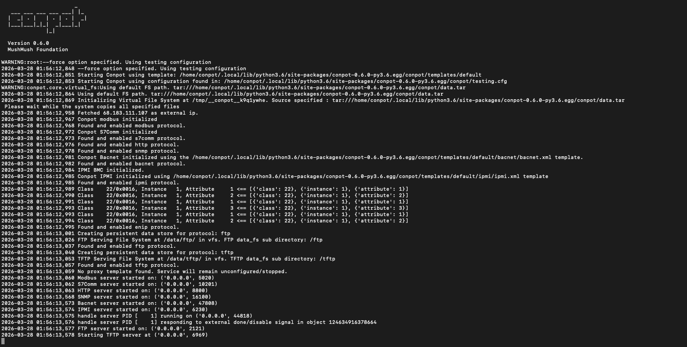
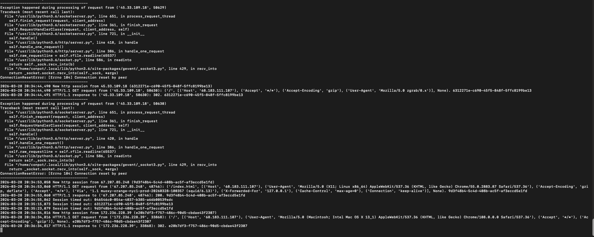
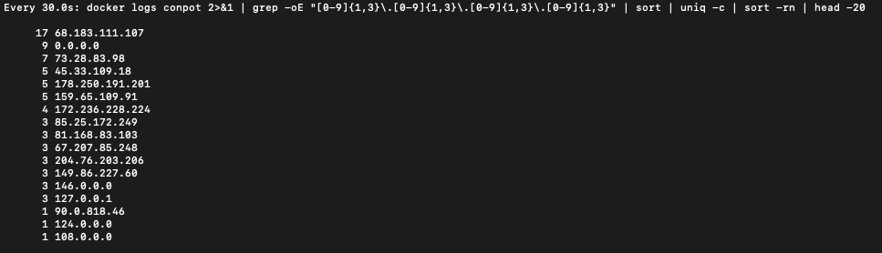

# ICS/OT Conpot Honeypot — Live Threat Intelligence Lab

A production ICS honeypot deployed on a public-facing VPS to capture real internet threat actor reconnaissance activity against simulated industrial control systems. Built as part of an ICS/OT cybersecurity portfolio to demonstrate hands-on threat intelligence collection and analysis.

---

## What is a Honeypot?

A honeypot is a deliberately exposed decoy system designed to attract attackers and observe their behavior. In ICS/OT security, honeypots are used to:

- Understand what adversaries look for when targeting industrial systems
- Collect threat intelligence on scanning tools, TTPs, and source infrastructure
- Study attacker behavior with zero risk to real operational technology

This lab uses **Conpot** — an open source ICS honeypot that impersonates real industrial devices including Siemens S7 PLCs, Modbus RTUs, and HMI web interfaces. Attackers and scanners that find this system believe they have discovered real industrial hardware.

---

## Lab Architecture
```
Internet
    │
    ▼
DigitalOcean Droplet (Ubuntu 24.04)
68.183.111.107
    │
    ▼
Docker Container (honeynet/conpot)
    │
    ├── Port 502  → Modbus TCP (fake PLC)
    ├── Port 80   → HTTP (fake Siemens HMI web interface)
    ├── Port 102  → S7Comm (fake Siemens S7 PLC)
    └── Port 161  → SNMP (fake network device)
```

---

## Why DigitalOcean VPS Instead of Home Lab

Running a honeypot on a home network exposes your personal devices and ISP-assigned IP to active threat actors. A VPS provides:

- **Complete isolation** from home network
- **Disposable infrastructure** — if compromised, delete and rebuild in minutes
- **Real public IP** with no NAT/firewall complications
- **Professional deployment** — this is how security researchers actually run honeypots

---

## Step 1 — Provisioning the VPS

### Create a DigitalOcean Droplet

1. Log into **digitalocean.com** → **Create → Droplets**
2. Configure:
   - **Region:** New York or closest region
   - **Image:** Ubuntu 24.04 LTS
   - **Size:** Basic → Regular → $6/month (1GB RAM)
   - **Authentication:** SSH key
   - **Hostname:** `conpot-honeypot`
3. Click **Create Droplet**

### Generate a Dedicated SSH Key

Never reuse SSH keys across projects. Generate a new key pair specifically for this honeypot:
```bash
ssh-keygen -t ed25519 -C "conpot-honeypot" -f ~/.ssh/conpot_key
```

- `-t ed25519` — modern elliptic curve algorithm, more secure than RSA
- `-C` — comment to identify the key
- `-f` — output filename

Get the public key to paste into DigitalOcean:
```bash
cat ~/.ssh/conpot_key.pub
```

### Connect to the Droplet
```bash
ssh -i ~/.ssh/conpot_key root@68.183.111.107
```

---

## Step 2 — Configuring the Firewall

DigitalOcean droplets accept all traffic by default. We need to restrict inbound access to only the ports Conpot needs, plus SSH for management.

### In DigitalOcean Dashboard:
**Networking → Firewalls → Create Firewall**

Name: `conpot-firewall`

**Inbound Rules:**

| Type | Protocol | Port | Purpose |
|------|----------|------|---------|
| Custom | TCP | 80 | HTTP — fake HMI web interface |
| Custom | TCP | 102 | S7Comm — fake Siemens S7 PLC |
| Custom | TCP | 502 | Modbus TCP — fake PLC |
| Custom | UDP | 161 | SNMP — fake network device |
| SSH | TCP | 22 | Management access |

**Outbound Rules:** Leave as default (allow all outbound)

Apply the firewall to the `conpot-honeypot` droplet.

### Why These Ports?

- **502** — Modbus TCP is the most common ICS protocol. Automated scanners specifically target this port looking for exposed PLCs
- **102** — S7Comm is Siemens-proprietary. Targeting this indicates knowledge of industrial systems
- **80** — HTTP exposes the fake HMI interface. Attackers look for web-based SCADA panels
- **161** — SNMP exposes device information. Attackers query SNMP to fingerprint industrial devices

---

## Step 3 — Installing Docker

Docker eliminates dependency conflicts and is the recommended deployment method for Conpot. It also mirrors real-world deployment practices.
```bash
# Update package lists
apt update && apt upgrade -y

# Install Docker
apt install -y docker.io

# Start Docker and enable on boot
systemctl start docker
systemctl enable docker

# Verify installation
docker --version
```

**Why Docker?** Conpot has complex Python dependencies that conflict with modern Python versions (3.10+). The Docker image packages Python 3.6 with all correct dependency versions, eliminating hours of troubleshooting.

---

## Step 4 — Deploying Conpot

### Pull and Run the Conpot Container
```bash
docker run -d \
  --restart unless-stopped \
  --name conpot \
  -p 502:5020 \
  -p 102:10201 \
  -p 80:8800 \
  -p 161:16100/udp \
  honeynet/conpot
```

**Flag breakdown:**
- `-d` — detached mode, runs in background
- `--restart unless-stopped` — auto-restarts if the droplet reboots
- `--name conpot` — names the container for easy reference
- `-p 502:5020` — maps external port 502 to Conpot's internal Modbus port 5020

**Why the non-standard internal ports?** Conpot runs as a non-root user inside Docker and cannot bind to privileged ports (below 1024) directly. Docker handles the mapping from standard ICS ports to Conpot's internal ports.

### Verify It's Running

From your Mac:
```bash
nc -zv 68.183.111.107 502
```

Expected output:
```
Connection to 68.183.111.107 port 502 [tcp/asa-appl-proto] succeeded!
```

### Screenshot — Conpot Startup



*Conpot v0.6.0 startup log showing all simulated ICS protocols initializing successfully. The honeypot detected its external IP (68.183.111.107) automatically. Active services: Modbus TCP, S7Comm (Siemens), HTTP, SNMP, BACnet, IPMI, EtherNet/IP, FTP, and TFTP — a comprehensive simulation of an exposed industrial network. Each protocol uses a different port internally that Docker maps to standard ICS ports externally.*

---

## Step 5 — The Fake HMI Interface

### Screenshot — Conpot HMI Web Interface


*The "Technodrome" HMI web interface served by Conpot on port 80. This is what any attacker or scanner sees when they connect to the HTTP port — a believable industrial web panel showing system status and uptime in deciseconds (a real ICS time unit). Scanners that successfully retrieve this page fingerprint the system as an active ICS/SCADA installation and may escalate to more targeted interaction.*

---

## Step 6 — Monitoring Live Traffic

### Set Up Persistent Log Collection
```bash
# Save all logs to file in background
docker logs -f conpot >> ~/conpot_hits.log 2>&1 &

# Watch top connecting IPs in real time (refreshes every 30 seconds)
watch -n 30 'docker logs conpot 2>&1 | grep -oE "[0-9]{1,3}\.[0-9]{1,3}\.[0-9]{1,3}\.[0-9]{1,3}" | sort | uniq -c | sort -rn | head -20'
```

### Screenshot — Live Attack Logs



*Live Conpot logs showing real internet traffic within the first hour of deployment. Three distinct scanner types visible: (1) IP 45.33.109.18 sending connection resets — classic port scanner behavior confirming the port is open without interacting, later identified as Shodan's scanner infrastructure; (2) IP 67.207.85.248 making HTTP GET requests through a Squid proxy with spoofed X-Forwarded-For headers set to 127.0.0.1 to hide true origin — a deliberate evasion technique; (3) IP 172.236.228.39 sending malformed HTTP requests that triggered a bug in Conpot's HTTP handler, consistent with fuzzing behavior probing for vulnerabilities.*

### Screenshot — Top Source IPs



*Top connecting IP addresses within the first hour ranked by connection count. The honeypot's own IP (68.183.111.107) appears at the top due to internal Docker health checks. Notable external sources: 73.28.83.98 (7 connections), 45.33.109.18 (5 connections — Shodan scanner), 178.250.191.201 (5 connections), 159.65.109.91 (5 connections). Multiple IPs making repeated connections suggests automated tools performing multi-stage reconnaissance rather than one-shot port scans.*

---

## Threat Intelligence Analysis

### Observed Attacker Behaviors

**1. Port Scanning / Service Discovery**
```
ConnectionResetError: [Errno 104] Connection reset by peer
Source: 45.33.109.18
```

TCP SYN scan pattern — connects to confirm port is open then immediately resets. No payload sent. This is Nmap or Masscan doing host discovery. IP `45.33.109.18` resolves to Linode infrastructure used by Shodan's scanning engine — confirms the honeypot was being indexed.

**MITRE ATT&CK for ICS: T0846 — Remote System Discovery**

**2. Proxy-Based Evasion**
```
Via: 1.1 muoxy-orange-nyc1-prod (squid/6.13)
X-Forwarded-For: 127.0.0.1
User-Agent: Chrome/55 (2016 era — spoofed)
Source: 67.207.85.248
```

Scanner routing traffic through a Squid proxy chain and setting `X-Forwarded-For` to loopback to obscure true origin. Spoofed user agent mimics a legitimate browser. This level of evasion suggests a more sophisticated automated tool than a basic port scanner.

**MITRE ATT&CK for ICS: T0883 — Internet Accessible Device**

**3. HTTP Fuzzing**
```
Bad request syntax
TypeError in Conpot HTTP handler
Source: 172.236.228.39
```

Malformed HTTP requests that triggered an unhandled exception in Conpot. Scanner sent something that didn't conform to HTTP spec — consistent with a fuzzer probing for vulnerabilities in whatever web service is running on port 80. Got a `302` on the first request then escalated to malformed requests on the second connection.

**MITRE ATT&CK for ICS: T0843 — Program Upload**

**4. ICS-Specific Reconnaissance**

Any connection to port 502 or 102 specifically indicates the scanner has ICS targeting capability. Generic web scanners don't probe Modbus or S7Comm ports — this traffic comes from tools specifically designed to find industrial systems.

**MITRE ATT&CK for ICS: T0888 — Remote System Information Discovery**

---

## Shodan Verification

Check if your honeypot has been indexed:
```bash
curl https://internetdb.shodan.io/68.183.111.107
```

Once indexed, Shodan will tag it with ICS-related CPEs and make it discoverable to anyone searching for exposed industrial systems — demonstrating exactly why internet-exposed ICS devices are so dangerous.

### Investigating Scanner Infrastructure

For any IP that hits your honeypot:
```bash
# Check Shodan data on the source IP
curl https://internetdb.shodan.io/<IP>

# Check abuse history
curl https://api.abuseipdb.com/api/v2/check?ipAddress=<IP>
```

Example finding from this lab: IP `204.76.203.206` was identified as running nginx 1.18.0 with multiple unpatched CVEs including CVE-2023-44487 (HTTP/2 Rapid Reset) and CVE-2025-23419 — a compromised or rented scanning host being used to probe ICS infrastructure while hiding the true attacker's identity.

---

## Key Findings

1. **Internet-exposed ICS devices are discovered within minutes** — the first connection attempt arrived within 30 minutes of deployment, before Shodan had even indexed the IP

2. **Scanners actively evade detection** — proxy chaining, spoofed user agents, and manipulated headers indicate sophisticated automated tooling specifically designed to avoid attribution

3. **Port 502 attracts ICS-specific tools** — connections to Modbus TCP port come from tools that know what they're looking for, not generic internet scanners

4. **Compromised infrastructure is used for reconnaissance** — scanner IPs often run vulnerable or end-of-life software, suggesting they are rented botnet nodes or compromised hosts rather than attacker-owned infrastructure

5. **The threat is continuous and automated** — no human is manually typing these commands. Fully automated tools continuously sweep the entire internet IPv4 space looking for exposed ICS devices

---

## Defensive Implications

This lab demonstrates why **air-gapping and network segmentation** are the primary security controls for ICS/OT environments:

- Modbus has no authentication — if an attacker can reach port 502 they can send arbitrary commands
- Any internet-exposed ICS device will be found and probed within hours
- The sophistication of observed scanning tools suggests organized, well-resourced threat actors
- IEC 62443 zone/conduit architecture and the Purdue Model exist specifically to prevent internet-accessible ICS devices

---

## Frameworks Referenced

- [MITRE ATT&CK for ICS](https://attack.mitre.org/matrices/ics/)
- [NIST SP 800-82 Rev 3](https://csrc.nist.gov/publications/detail/sp/800-82/rev-3/final)
- [IEC 62443](https://www.iec.ch/iec62443)
- [Conpot Project](http://conpot.org)
- [Shodan ICS Filters](https://www.shodan.io/search?query=port%3A502)

---

## Related Projects

- [ICS Modbus Homelab](https://github.com/bsuar6/ics-modbus-lab) — Modbus protocol analysis and anomaly detection lab

---

## Next Steps

- [ ] Parse logs into structured JSON for analysis
- [ ] Build a dashboard to visualize attacker geolocation and protocol distribution
- [ ] Configure Conpot to log to a SIEM
- [ ] Correlate observed scanner IPs against known threat actor infrastructure
- [ ] Add DNP3 and EtherNet/IP port monitoring
