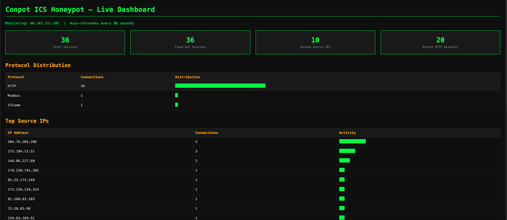
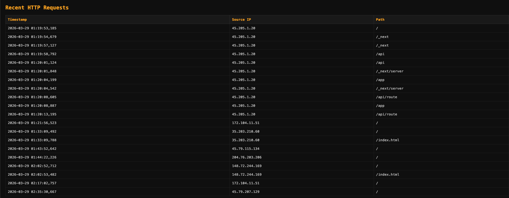
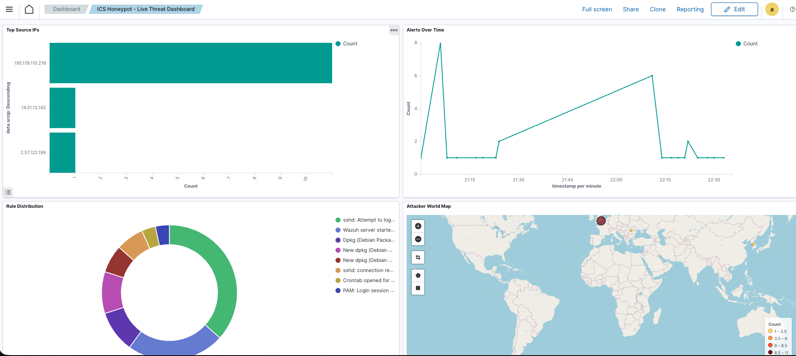

# ICS/OT Conpot Honeypot — Live Threat Intelligence Lab with SIEM Integration

A production ICS honeypot deployed on a public-facing VPS to capture real internet threat actor reconnaissance activity against simulated industrial control systems. Includes a custom Flask monitoring dashboard and a Wazuh SIEM with custom decoders, detection rules, and OpenSearch visualizations.

---

## What is a Honeypot?

A honeypot is a deliberately exposed decoy system designed to attract attackers and observe their behavior. In ICS/OT security, honeypots are used to:

- Understand what adversaries look for when targeting industrial systems
- Collect threat intelligence on scanning tools, TTPs, and source infrastructure
- Study attacker behavior with zero risk to real operational technology

This lab uses **Conpot** — an open source ICS honeypot that impersonates real industrial devices including Siemens S7 PLCs, Modbus RTUs, and HMI web interfaces. Attackers and scanners that find this system believe they have discovered real industrial hardware.

---

## Full Architecture
```
Internet
    │
    ▼
DigitalOcean Droplet 1 — Conpot Honeypot (68.183.111.107)
    │
    ├── Port 80   → HTTP (fake Siemens HMI web interface)
    ├── Port 102  → S7Comm (fake Siemens S7 PLC)
    ├── Port 502  → Modbus TCP (fake PLC)
    ├── Port 161  → SNMP (fake network device)
    └── Port 8888 → Flask monitoring dashboard
    │
    │  Wazuh agent (port 1514)
    ▼
DigitalOcean Droplet 2 — Wazuh SIEM (147.182.245.31)
    │
    ├── Wazuh Manager — receives and analyzes logs
    ├── Wazuh Indexer — stores events (OpenSearch)
    └── Wazuh Dashboard — web UI at https://147.182.245.31
```

---

## Why DigitalOcean VPS Instead of Home Lab

Running a honeypot on a home network exposes personal devices and ISP-assigned IP to active threat actors. A VPS provides:

- **Complete isolation** from home network
- **Disposable infrastructure** — if compromised, delete and rebuild in minutes
- **Real public IP** with no NAT/firewall complications
- **Professional deployment** — this is how security researchers actually run honeypots

---

## Part 1 — Conpot Honeypot Deployment

### Step 1 — Provisioning the VPS

**Create a DigitalOcean Droplet:**

1. Log into **digitalocean.com** → **Create → Droplets**
2. Configure:
   - **Region:** New York
   - **Image:** Ubuntu 24.04 LTS
   - **Size:** Basic → Regular → $6/month (1GB RAM)
   - **Authentication:** SSH key
   - **Hostname:** `conpot-honeypot`

**Generate a dedicated SSH key — never reuse keys across projects:**
```bash
ssh-keygen -t ed25519 -C "conpot-honeypot" -f ~/.ssh/conpot_key
```

- `-t ed25519` — modern elliptic curve algorithm, more secure than RSA
- `-C` — comment to identify the key
- `-f` — output filename specifying a dedicated key for this project

Get the public key to paste into DigitalOcean:
```bash
cat ~/.ssh/conpot_key.pub
```

**Connect to the droplet:**
```bash
ssh -i ~/.ssh/conpot_key root@68.183.111.107
```

---

### Step 2 — Configuring the Firewall

DigitalOcean droplets accept all traffic by default. Restrict inbound access to only the ports Conpot needs.

**In DigitalOcean Dashboard: Networking → Firewalls → Create Firewall**

Name: `conpot-firewall`

**Inbound Rules:**

| Type | Protocol | Port | Purpose |
|------|----------|------|---------|
| Custom | TCP | 80 | HTTP — fake HMI web interface |
| Custom | TCP | 102 | S7Comm — fake Siemens S7 PLC |
| Custom | TCP | 502 | Modbus TCP — fake PLC |
| Custom | UDP | 161 | SNMP — fake network device |
| Custom | TCP | 8888 | Flask monitoring dashboard |
| SSH | TCP | 22 | Management access |

**Why these ports?**
- **502** — Modbus TCP is the most common ICS protocol. Automated scanners specifically target this port looking for exposed PLCs
- **102** — S7Comm is Siemens-proprietary. Targeting this indicates knowledge of industrial systems
- **80** — HTTP exposes the fake HMI interface. Attackers look for web-based SCADA panels
- **161** — SNMP exposes device information. Attackers query SNMP to fingerprint industrial devices

---

### Step 3 — Installing Docker

Docker eliminates dependency conflicts and is the recommended deployment method for Conpot.
```bash
apt update && apt upgrade -y
apt install -y docker.io
systemctl start docker
systemctl enable docker
docker --version
```

**Why Docker?** Conpot has complex Python dependencies that conflict with modern Python versions (3.10+). The Docker image packages Python 3.6 with all correct dependency versions. Attempting to install Conpot directly on Ubuntu 24.04 results in multiple incompatibility errors with pysnmp, pyasn1, scapy, and asyncore — all removed or changed in Python 3.12.

---

### Step 4 — Deploying Conpot
```bash
docker run -d \
  --restart unless-stopped \
  --name conpot \
  -p 502:5020 \
  -p 102:10201 \
  -p 80:8800 \
  -p 161:16100/udp \
  honeynet/conpot
```

**Flag breakdown:**
- `-d` — detached mode, runs in background
- `--restart unless-stopped` — auto-restarts if the droplet reboots
- `--name conpot` — names the container for easy reference
- `-p 502:5020` — maps external port 502 to Conpot's internal Modbus port 5020

**Why non-standard internal ports?** Conpot runs as a non-root user inside Docker and cannot bind to privileged ports (below 1024) directly. Docker handles the external-to-internal port mapping.

**Verify connectivity from Mac:**
```bash
nc -zv 68.183.111.107 502
```

Expected:
```
Connection to 68.183.111.107 port 502 succeeded!
```

**Protocols simulated by Conpot:**

| Protocol | External Port | Purpose |
|----------|--------------|---------|
| Modbus TCP | 502 | Fake PLC registers |
| S7Comm | 102 | Fake Siemens S7 PLC |
| HTTP | 80 | Fake Siemens HMI web interface |
| SNMP | 161 | Fake network device management |
| BACnet | — | Building automation protocol |
| IPMI | — | Server management interface |
| EtherNet/IP | — | Rockwell/Allen-Bradley protocol |
| FTP/TFTP | — | File transfer services |

---

### Step 5 — The Fake HMI Interface

Conpot serves a "Technodrome" HMI web interface on port 80 showing system status and uptime in deciseconds — a real ICS time unit. Scanners that retrieve this page fingerprint the system as an active ICS/SCADA installation.


*The fake Siemens HMI web interface served by Conpot. Any attacker or scanner connecting to port 80 sees a believable industrial control panel.*

---

### Step 6 — Persistent Log Collection

Write Conpot logs to a file for Wazuh ingestion and persistent storage:
```bash
docker logs -f conpot >> /var/log/conpot.log 2>&1 &
```

Add to crontab so it restarts on reboot:
```bash
crontab -e
```

Add:
```
@reboot docker logs -f conpot >> /var/log/conpot.log 2>&1 &
```

---

## Part 2 — Flask Monitoring Dashboard

A custom Python Flask dashboard deployed on the Conpot droplet provides real-time visibility into honeypot activity, auto-refreshing every 30 seconds.

### Installation
```bash
pip install flask requests --break-system-packages --ignore-installed
```

### Running as a Persistent Service

Create a systemd service so the dashboard survives reboots:
```bash
nano /etc/systemd/system/dashboard.service
```
```ini
[Unit]
Description=Conpot Honeypot Dashboard
After=network.target docker.service

[Service]
Type=simple
Restart=always
RestartSec=3
User=root
ExecStart=/usr/bin/python3 /root/dashboard.py

[Install]
WantedBy=multi-user.target
```
```bash
systemctl daemon-reload
systemctl enable dashboard
systemctl start dashboard
```

Access at: `http://68.183.111.107:8888`

### Dashboard Features

- Total sessions and timed out sessions counter
- Protocol distribution (HTTP, Modbus, S7Comm) with visual bars
- Top 10 source IPs ranked by connection count
- Recent HTTP requests table with timestamps, source IPs, and paths

### Screenshot — Conpot Live Dashboard



*Live dashboard showing 36 total sessions, 10 unique source IPs, and protocol distribution across HTTP (34), Modbus (1), and S7Comm (1). The presence of Modbus and S7Comm connections confirms ICS-specific tools are targeting the honeypot — not just generic web scanners.*

### Screenshot — Recent HTTP Requests



*Recent HTTP requests table. IP `45.205.1.20` made 11 rapid sequential requests probing Next.js paths (`/_next`, `/api`, `/api/route`, `/app`) — a framework-specific scanner that incorrectly fingerprinted the fake ICS HMI as a Node.js web application. This demonstrates how automated tools use technology-specific wordlists regardless of the actual target.*

---

## Part 3 — Wazuh SIEM Integration

### Why a Separate Droplet for Wazuh?

Wazuh requires a minimum of 4GB RAM. Running it on the same droplet as Conpot would consume resources needed for the honeypot and contaminate logs. Separate infrastructure mirrors real-world SOC architecture where sensors and SIEM are always on different systems.

### Step 1 — Provision the Wazuh Droplet

**DigitalOcean → Create → Droplets:**
- **Image:** Ubuntu 24.04 LTS
- **Size:** $24/month (4GB RAM / 2 vCPUs) — minimum for Wazuh
- **SSH key:** Same `conpot_key`
- **Hostname:** `wazuh-siem`
```bash
ssh -i ~/.ssh/conpot_key root@147.182.245.31
```

### Step 2 — Install Wazuh
```bash
curl -sO https://packages.wazuh.com/4.7/wazuh-install.sh
sudo bash wazuh-install.sh -a -i
```

The `-i` flag bypasses the Ubuntu 24.04 compatibility check — Wazuh 4.7 works on 24.04 but hasn't been officially certified yet.

**Save the generated credentials immediately** — they are only shown once.

Access the dashboard at `https://147.182.245.31` with the generated admin credentials.

### Step 3 — Configure Wazuh Firewall

**DigitalOcean → Networking → Firewalls → Create Firewall**

Name: `wazuh-firewall`

| Type | Protocol | Port | Source |
|------|----------|------|--------|
| Custom | TCP | 1514 | 68.183.111.107 only |
| Custom | TCP | 1515 | 68.183.111.107 only |
| HTTPS | TCP | 443 | Your Mac IP |
| SSH | TCP | 22 | Your Mac IP |

**Why restrict 1514/1515 to the Conpot IP only?** These are Wazuh agent communication ports. Exposing them to the internet would allow anyone to register rogue agents with your SIEM manager.

### Step 4 — Install Wazuh Agent on Conpot Droplet

SSH into the **Conpot droplet** and install the matching agent version:
```bash
curl -s https://packages.wazuh.com/key/GPG-KEY-WAZUH | gpg --no-default-keyring \
  --keyring gnupg-ring:/usr/share/keyrings/wazuh.gpg --import
chmod 644 /usr/share/keyrings/wazuh.gpg

echo "deb [signed-by=/usr/share/keyrings/wazuh.gpg] https://packages.wazuh.com/4.x/apt/ stable main" \
  | tee /etc/apt/sources.list.d/wazuh.list

apt update

# Install version matching the manager (4.7.5)
wget https://packages.wazuh.com/4.x/apt/pool/main/w/wazuh-agent/wazuh-agent_4.7.5-1_amd64.deb
dpkg -i wazuh-agent_4.7.5-1_amd64.deb
```

**Why version matching matters:** The Wazuh agent version must be equal to or lower than the manager version. Installing a newer agent (4.14.4 from the default repo) against a 4.7.5 manager causes authentication failures.

**Configure the manager IP:**
```bash
sed -i 's/MANAGER_IP/147.182.245.31/' /var/ossec/etc/ossec.conf
systemctl enable wazuh-agent
systemctl start wazuh-agent
```

**Verify connection:**
```bash
grep "Connected to the server" /var/ossec/logs/ossec.log
```

### Step 5 — Configure Conpot Log Ingestion

Add the Conpot log file as a monitored source on the **Conpot droplet**:
```bash
nano /var/ossec/etc/ossec.conf
```

Add before the last `</ossec_config>` tag:
```xml
<localfile>
  <log_format>full_command</log_format>
  <command>docker logs --since 60s conpot 2>&1</command>
  <frequency>60</frequency>
</localfile>

<localfile>
  <log_format>syslog</log_format>
  <location>/var/log/conpot.log</location>
</localfile>
```
```bash
systemctl restart wazuh-agent
```

### Step 6 — Enable Log Archives on Wazuh Manager

SSH into the **Wazuh manager droplet** and enable full log archiving:
```bash
sed -i 's/<logall>no<\/logall>/<logall>yes<\/logall>/' /var/ossec/etc/ossec.conf
sed -i 's/<logall_json>no<\/logall_json>/<logall_json>yes<\/logall_json>/' /var/ossec/etc/ossec.conf
systemctl restart wazuh-manager
```

Archives stored at: `/var/ossec/logs/archives/archives.log`

### Step 7 — Custom Conpot Decoder

Create a decoder so Wazuh understands Conpot's log format:
```bash
nano /var/ossec/etc/decoders/conpot_decoders.xml
```
```xml
<decoder name="conpot">
  <prematch>New http session from|HTTP/1.1 GET request from|Session timed out|New modbus session|New s7comm session</prematch>
</decoder>

<decoder name="conpot-http-session">
  <parent>conpot</parent>
  <regex>New http session from (\d+\.\d+\.\d+\.\d+)</regex>
  <order>srcip</order>
</decoder>

<decoder name="conpot-http-request">
  <parent>conpot</parent>
  <regex>HTTP/1.1 GET request from \('(\d+\.\d+\.\d+\.\d+)'</regex>
  <order>srcip</order>
</decoder>

<decoder name="conpot-session-timeout">
  <parent>conpot</parent>
  <prematch>Session timed out</prematch>
</decoder>
```

**Test the decoder:**
```bash
echo "New http session from 159.223.216.61" | /var/ossec/bin/wazuh-logtest
```

Expected output confirms decoder match and rule firing.

### Step 8 — Custom Detection Rules
```bash
nano /var/ossec/etc/rules/conpot_rules.xml
```
```xml
<group name="conpot,ics,honeypot">

  <rule id="100001" level="5">
    <decoded_as>conpot</decoded_as>
    <match>New http session</match>
    <description>Conpot: New HTTP connection to fake HMI</description>
    <group>conpot,http,ics_recon</group>
  </rule>

  <rule id="100002" level="5">
    <decoded_as>conpot</decoded_as>
    <match>HTTP/1.1 GET request</match>
    <description>Conpot: HTTP GET request to fake HMI</description>
    <group>conpot,http,ics_recon</group>
  </rule>

  <rule id="100003" level="3">
    <decoded_as>conpot</decoded_as>
    <match>Session timed out</match>
    <description>Conpot: Session timed out - likely automated scanner</description>
    <group>conpot,scanner</group>
  </rule>

</group>
```

### Step 9 — False Positive Suppression

Wazuh's rootcheck flagged `/bin/diff` and `/usr/bin/diff` as trojaned binaries. Investigation confirmed this was a false positive — both files had identical SHA256 hashes, matching timestamps, and are legitimate ELF binaries from the `diffutils` package. The signature match was a pattern overlap with Wazuh's generic trojan detection regex.

**Suppression rule:**
```bash
nano /var/ossec/etc/rules/local_rules.xml
```
```xml
<group name="local,syslog">

  <rule id="100100" level="0">
    <if_sid>510</if_sid>
    <match>/bin/diff</match>
    <description>False positive: Wazuh rootcheck flagging legitimate diff binary</description>
  </rule>

</group>
```

Setting level to `0` suppresses the alert completely. This is standard SOC practice — investigating alerts, confirming false positives, and writing suppression rules to reduce noise is a core analyst workflow.
```bash
systemctl restart wazuh-manager
```

---

## Part 4 — Wazuh OpenSearch Dashboard

A custom dashboard built in Wazuh's OpenSearch interface provides correlated threat intelligence visualization.

**Four visualizations:**

| Panel | Type | Data |
|-------|------|------|
| Top Source IPs | Horizontal Bar | `data.srcip` terms aggregation |
| Alerts Over Time | Line Chart | `timestamp` date histogram |
| Rule Distribution | Pie Chart | `rule.description` terms aggregation |
| Attacker World Map | Coordinate Map | `GeoLocation.location` geohash |

**Index pattern:** `wazuh-alerts-*`

### Screenshot — Wazuh SIEM Dashboard



*Custom "ICS Honeypot — Live Threat Dashboard" in Wazuh OpenSearch. Top left: bar chart showing `195.178.110.218` as the most active attacker. Top right: alerts over time line chart with burst peaking at 8 alerts per minute. Bottom left: rule distribution pie dominated by SSH brute force with secondary slices for Conpot sessions and system events. Bottom right: world map with attack concentration over Eastern Europe (Romania) and Western Europe (Netherlands).*

---

## Threat Intelligence Findings

### Finding 1 — Immediate Discovery

The honeypot received its first connection attempt within 30 minutes of deployment, before Shodan had indexed the IP. Automated tools continuously sweep the entire IPv4 address space — any internet-exposed ICS device will be found within hours.

### Finding 2 — ICS-Specific Targeting

Connections to ports 502 (Modbus) and 102 (S7Comm) confirm ICS-specific scanning tools are active on the internet. Generic web scanners do not probe these ports — this traffic originates from tools purpose-built to find industrial systems.

### Finding 3 — Coordinated Romanian Botnet — SSH Credential Stuffing

**Source:** IP range `2.57.121.x` and `2.57.122.x` (Romania)

A coordinated botnet making SSH brute force attempts every 90 seconds using a rotating wordlist of cryptocurrency-specific usernames:

`solana`, `solv`, `validator`, `node`, `evm`, `evmbot`, `trader`, `trading`, `sniper`, `bot`, `ubuntu`

This is a **crypto-targeting botnet** systematically scanning for exposed blockchain infrastructure. The username wordlist is specifically curated for Solana validators, EVM nodes, and crypto trading bots — not generic SSH brute force.

**MITRE ATT&CK:** T1110.001 — Password Guessing

### Finding 4 — Proxy-Based Evasion
```
Via: 1.1 muoxy-orange-nyc1-prod (squid/6.13)
X-Forwarded-For: 127.0.0.1
User-Agent: Chrome/55 (2016 — spoofed)
```

Scanner routing traffic through a Squid proxy chain and setting `X-Forwarded-For` to loopback to obscure true origin. Spoofed user agent mimics a 2016-era browser. This level of evasion indicates sophisticated automated tooling.

**MITRE ATT&CK for ICS:** T0883 — Internet Accessible Device

### Finding 5 — Compromised Scanning Infrastructure

IP `204.76.203.206` (pfcloud.network) was identified as running nginx 1.18.0 with multiple unpatched CVEs:
- **CVE-2023-44487** — HTTP/2 Rapid Reset DDoS
- **CVE-2025-23419** — 2025 nginx vulnerability
- **CVE-2021-23017** — nginx DNS resolver

This is a compromised or rented host being used as scanning infrastructure — a common technique to hide attacker identity and distribute scanning load.

### Finding 6 — Next.js Framework Scanner

IP `45.205.1.20` made 11 rapid requests probing Next.js paths (`/_next`, `/api`, `/api/route`, `/app`) against the fake ICS HMI. The scanner incorrectly fingerprinted the Conpot HTTP interface as a Node.js web application and switched to a framework-specific wordlist. This demonstrates how automated tools use technology fingerprinting to select attack modules.

### Finding 7 — False Positive Investigation

Wazuh rootcheck flagged `/bin/diff` and `/usr/bin/diff` as trojaned binaries (rule 510, level 7). Full investigation:
```bash
sha256sum /bin/diff /usr/bin/diff
# Both returned identical hashes — same file
file /bin/diff
# Confirmed legitimate ELF 64-bit binary
dpkg -S /usr/bin/diff
# Confirmed owned by diffutils package
```

**Verdict:** False positive. Wazuh's generic trojan signature `bash|^/bin/sh|file.h|proc.h` matched a string pattern inside the legitimate binary. Suppression rule written and documented.

---

## Key Security Findings

1. **Internet-exposed ICS devices are discovered within minutes** — automated tools sweep the entire IPv4 space continuously
2. **Scanners actively evade detection** — proxy chaining, spoofed user agents, and manipulated headers indicate sophisticated tooling
3. **Port 502 attracts ICS-specific tools** — not generic internet scanners
4. **Compromised infrastructure is used for reconnaissance** — scanner IPs often run vulnerable software
5. **The threat is continuous and automated** — no human is manually typing these commands
6. **False positive investigation is a core SOC skill** — not every alert is malicious; verification and suppression rule writing are essential analyst tasks

---

## Defensive Implications

This lab demonstrates why **air-gapping and network segmentation** are the primary security controls for ICS/OT environments per IEC 62443 and NIST SP 800-82:

- Modbus has no authentication — if an attacker reaches port 502 they can send arbitrary commands
- Any internet-exposed ICS device will be found and probed within hours
- The sophistication of observed scanning tools suggests organized, well-resourced threat actors

---

## Frameworks Referenced

- [MITRE ATT&CK for ICS](https://attack.mitre.org/matrices/ics/)
- [NIST SP 800-82 Rev 3](https://csrc.nist.gov/publications/detail/sp/800-82/rev-3/final)
- [IEC 62443](https://www.iec.ch/iec62443)
- [Wazuh Documentation](https://documentation.wazuh.com)
- [Conpot Project](http://conpot.org)

---

## Related Projects

- [ICS Modbus Homelab](https://github.com/bsuar6/ics-modbus-lab) — Modbus protocol analysis and anomaly detection lab

---

## Next Steps

- [ ] Parse Conpot logs into structured JSON for deeper analysis
- [ ] Correlate observed scanner IPs against threat intel feeds (AbuseIPDB, OTX)
- [ ] Add Wazuh active response to auto-block repeat offenders
- [ ] Extend Conpot decoder to capture Modbus and S7Comm session details
- [ ] Build geolocation heatmap from accumulated attack data
- [ ] Add DNP3 and EtherNet/IP port monitoring
